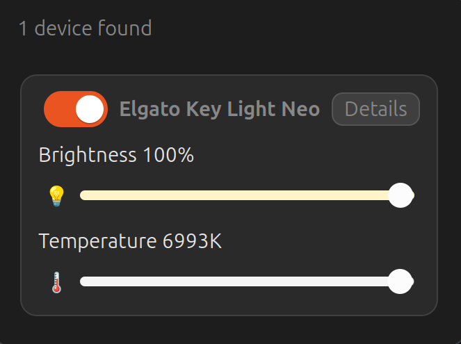

# Key Light Controller (GNOME Extension)

Modern GNOME Shell extension to discover and control Elgato Key Light devices directly from the top bar.



## Features

- Auto-discovery on your LAN (Avahi + fallback probes)
- Power toggle
- Brightness slider with device-aware max brightness
- Temperature slider with device-safe value clamping
- Live slider label/color feedback while dragging
- Per-device details panel (IP, MAC, serial, firmware, hardware data)

## Requirements

- GNOME Shell 45+
- `avahi-daemon` running
- Key Light device on the same network

## Project layout

```text
.
├── src/
│   └── extension/
│       ├── extension.js          # extension entrypoint
│       ├── keyLightIndicator.js  # main UI/controller logic
│       ├── avahiDiscovery.js
│       ├── elgatoClient.js
│       ├── constants.js
│       ├── utils.js
│       ├── metadata.json
│       └── stylesheet.css
├── Makefile
├── docs/
├── dist/
├── pack/
│   └── README.md
├── LICENSE
└── README.md
```

## Local development

Install/update into your local GNOME extensions directory:

```bash
make install-local
```

Restart GNOME Shell:

- X11: `Alt+F2`, then run `r`
- Wayland: log out and log back in

Enable extension:

```bash
gnome-extensions enable keylight-controller@toaksoy
```

## Build and validate

```bash
make validate
make build
```

Output archive is created in `dist/`.

## Useful commands

```bash
gnome-extensions list | rg keylight
gnome-extensions disable keylight-controller@toaksoy
gnome-extensions enable keylight-controller@toaksoy
journalctl --user -f /usr/bin/gnome-shell
```

## Notes

- Discovery runs automatically on startup and continues with periodic refreshes.
- If no devices appear, verify Avahi:

  ```bash
  systemctl status avahi-daemon
  ```
